# Editor for Treebanks in CoNLL-U format and Front-End for dependency parser servers

This Software is a tool which facilitates the editing of syntactic relations and morphological features of files in CoNLL-U format
(http://universaldependencies.org/format.html). It uses a Java-based server and a HTML/CSS/Javascript based front-end. The editor
loads the CoNLL-U file and saves changes to disk (and performs a `git commit` if the file is under git version control).

The editor provides the following functionalities:
* editing words (forms, lemmas, upos, xpos, features, enhanced dependencies) (fast edit for UPOS and deprel)
* editing dependency relations
* indicates invalid UPOS, XPOS or dependency relations
* join/split/delete words (to correct tokenization errors)
* join/split sentences (to correct segmentation errors)
* undo/redo (partially)
* search: forms, lemmas, UPOS, XPOS, deprels, sentences IDs and comments, sequences of any of these,
      searching for subtrees, importing subtrees from current sentence, sd-parse support
* edit non-CoNLL-U columns in a subset of [CoNLL-U plus files](http://universaldependencies.org/ext-format.html)
* create multiword tokens from existing words or add a MWT to contract two ore more existing words
* git support
* export of dependency graphs as svg or LaTeX (for the [tikz-dependency](https://ctan.org/pkg/tikz-dependency) package or
  the [doc/deptree.sty](doc/deptree.sty) class, see [documentation](doc/deptree-doc.pdf))
* prohibits invalid (cyclic) trees
* Three edit modes: dependency trees, dependency «hedges» and a table edit mode
* mass editing: modify tokens if a (complex) condition is satisfied
* sentence metadata editing
* adding Translit= values to the MISC column (transliterating the FORM column) see section [Transliteration](#transliteration)
* finding similar or identical sentence in a list of CoNLL-U files, see section [Find Similar Sentences](#find-similar-sentences)

Current version: 2.17.4 (see [change history](CHANGES.md))

ConlluEditor can also be used as front-end to display the results of dependency parsing in the same way as the editor.
* dependency tree/dependency hedge
* CoNLL-U/LaTeX/SD-Parse format

For more information see section [Parser Front-End](#parser-front-end)

In order to compare two files (e.g. a gold file with a predicted file) ConlluEditor provides
* a file compare mode

For more information see section [File Comparison](#file-comparison)


## Installation

### Requirements

* Java jre >= 11.0
* Firefox (tested with version 60.9 on Windows 10, >= 63 on Linux and 69.0.1 on MacOS Sierra),
  Chromium or Chrome (both tested with version 70 on Linux),
  Edge (tested with version 44.17763.1.0 on Windows 10),
  Opera (tested with version 63 on Linux),
  Safari (tested with version 11.1 on MacOS Sierra)
* jquery 3.3.1 (https://code.jquery.com/jquery-3.3.1.min.js) and jquery-ui 1.12.1 (https://jqueryui.com)
* bootstrap 4.1.3 (https://github.com/twbs/bootstrap/releases/download/v4.1.3/bootstrap-4.1.3-dist.zip)
* popper.min.js and popper.min.js.map 1.14.6 (https://unpkg.com/popper.js/dist/umd/popper.min.js{.map}), needed by bootstrap
* on MacOS: `greadlink` (`brew install coreutils`)

In order two compile the server, you also need
* Java jdk >= 11.0
* maven (tested with >= 3.3.9)

#### Docker

Alternatively, a recent version of Docker can be used to run the docker image (see section [docker](#docker) below)

#### Github Release

To avoid compilation, you can download the latest release, unzip the conllueditor-a.b.c.zip into a directory and start the server
as described below.

### License
* This software is under the [3-Clause BSD License](LICENSE)

### Compilation

* `mvn install`
  * if the tests fail after `git pull` try deleting `target/test-classes` and `testoutput`. If this does not solve the problem, run `mvn install -DskipTests` to avoid running the JUnit tests and drop me a note
  * individual tests can be run by `mvn test -Dtest=TestConlluEditor#<testmethod>`)
  * redirect stderr in order to see only maven messages:
    * `mvn install 2> stderr_output.txt`
    * `mvn test -Dtest=TestConlluEditor#<testmethod>  2> stderr_output.txt`
* download javascript libraries (bootstrap, popper, jquery and jquery-ui), the script [bin/installJQ.sh](bin/installJQ.sh) will do the job
* or change the corresponding lines in [gui/index.html](gui/index.html) to load the libraries from a public server:

```
<script type="text/javascript" src="https://ajax.googleapis.com/ajax/libs/jquery/3.3.1/jquery.min.js">
```

* after having run `bin/installJQ.sh` the `gui/lib` directory must look like this

```
./gui/lib/bootstrap-4.1.3/js/bootstrap.min.js
./gui/lib/bootstrap-4.1.3/js/bootstrap.bundle.js.map
./gui/lib/bootstrap-4.1.3/js/bootstrap.js.map
./gui/lib/bootstrap-4.1.3/js/bootstrap.bundle.min.js.map
./gui/lib/bootstrap-4.1.3/js/bootstrap.bundle.js
./gui/lib/bootstrap-4.1.3/js/bootstrap.js
./gui/lib/bootstrap-4.1.3/js/bootstrap.bundle.min.js
./gui/lib/bootstrap-4.1.3/js/bootstrap.min.js.map
./gui/lib/bootstrap-4.1.3/css/bootstrap-grid.css.map
./gui/lib/bootstrap-4.1.3/css/bootstrap.min.css.map
./gui/lib/bootstrap-4.1.3/css/bootstrap-grid.min.css.map
./gui/lib/bootstrap-4.1.3/css/bootstrap.css.map
./gui/lib/bootstrap-4.1.3/css/bootstrap-reboot.min.css
./gui/lib/bootstrap-4.1.3/css/bootstrap-reboot.css.map
./gui/lib/bootstrap-4.1.3/css/bootstrap-grid.min.css
./gui/lib/bootstrap-4.1.3/css/bootstrap-grid.css
./gui/lib/bootstrap-4.1.3/css/bootstrap.min.css
./gui/lib/bootstrap-4.1.3/css/bootstrap-reboot.css
./gui/lib/bootstrap-4.1.3/css/bootstrap.css
./gui/lib/bootstrap-4.1.3/css/bootstrap-reboot.min.css.map
./gui/lib/jquery-3.3.1.min.js
./gui/lib/popper.min.js
./gui/lib/popper.min.js.map
./gui/lib/jquery-ui-1.12.1
./gui/lib/jquery-ui-1.12.1/jquery-ui.min.css
./gui/lib/jquery-ui-1.12.1/LICENSE.txt
./gui/lib/jquery-ui-1.12.1/jquery-ui.theme.min.css
./gui/lib/jquery-ui-1.12.1/jquery-ui.structure.css
./gui/lib/jquery-ui-1.12.1/images
./gui/lib/jquery-ui-1.12.1/images/ui-icons_cc0000_256x240.png
./gui/lib/jquery-ui-1.12.1/images/ui-icons_444444_256x240.png
./gui/lib/jquery-ui-1.12.1/images/ui-icons_555555_256x240.png
./gui/lib/jquery-ui-1.12.1/images/ui-icons_777620_256x240.png
./gui/lib/jquery-ui-1.12.1/images/ui-icons_777777_256x240.png
./gui/lib/jquery-ui-1.12.1/images/ui-icons_ffffff_256x240.png
./gui/lib/jquery-ui-1.12.1/jquery-ui.structure.min.css
./gui/lib/jquery-ui-1.12.1/jquery-ui.css
./gui/lib/jquery-ui-1.12.1/jquery-ui.theme.css
./gui/lib/jquery-ui-1.12.1/AUTHORS.txt
./gui/lib/jquery-ui-1.12.1/index.html
./gui/lib/jquery-ui-1.12.1/jquery-ui.js
./gui/lib/jquery-ui-1.12.1/package.json
./gui/lib/jquery-ui-1.12.1/external
./gui/lib/jquery-ui-1.12.1/external/jquery
./gui/lib/jquery-ui-1.12.1/external/jquery/jquery.js
./gui/lib/jquery-ui-1.12.1/jquery-ui.min.js
```

### Update ConlluEditor

to get bug corrections/new features, run

```
git pull
rm -rf target/test-classes
mvn install
```


## Starting the server

On smaller machines, the memory management of the java VM (`-Xmx...` option) may have to be modified in
`bin/conlluedit.sh`. The current value (`-Xmx4g`) is largely sufficient to load larger treebanks with up to 1,5M tokens.


ConlluEditor comes with a simple HTTP server:

```bash
bin/conlluedit.sh --rootdir  /path/to/ConlluEditor/gui treebank.conllu 8888
```

or (the option `-r` calculates the rootdir from the position of `conlluedit.sh`)

```bash
bin/conlluedit.sh -r treebank.conllu 8888
```

Point your navigator  to `http://localhost:8888` .


### Using docker

If you prefer a docker image, you can use the following

* get current docker image
``` bash
docker pull jheinecke/conllueditor:latest
```

Run the image in a docker container from the directory where your `.conllu`-file (and other files like lists of UPOS, XPOS etc) reside and replace
* `--user 1000:1000` with your uid and gid (you get the uid on Linux with the `id`-command)
* `--env filename=<yourfile>.conllu` with the filename you want to edit
* `</absolute/path/to/datadir>` with the directory where the `.conllu`-file and other files reside

```
docker run --rm -t -d \
  --name conllueditor -p 8888:5555 \
	--user 1000:1000 \
	-v </absolute/path/to/datadir>:/data \
	--env filename=<yourfile>.conllu \
	jheinecke/conllueditor:latest
```

Note that the option `-d` causes the docker container to run in the background and error messages will not appear on screen unless you run `docker logs conllueditor`. If you want to see any messages the server outputs to the terminal, omit the `-d`.

Other parameters (shown below in section [other options](#other-options)) can be given with
`--env <optionname>=value` e.g.
`--env UPOS=uposfile.txt`,
`--env UPOS=cpos.ud`,
`--env XPOS=xpos.txt`,
`--env language=cy`,
`--env include_unused=1`,
`--env deprels=deprels.ud`,
`--env features=feat_val.ud`,
`--env shortcuts=hortcuts.json`, or
`--env compare=file.conllu`,
. However all files given, **must** reside in the `</absolute/path/to/datadir>` directory.

When finished, stop the docker container (it is removed automatically by the `--rm` option given):

```
docker stop conllueditor
```


### Other options
* `--UPOS <file>` comma separated list of files containing valid UPOS tags (see https://github.com/UniversalDependencies/tools/tree/master/data/cpos.ud)
* `--XPOS <file>` comma separated list of files containing valid XPOS tags
* `--deprels <file>` comma separated list of files, containing valid dependency relation names (see https://github.com/UniversalDependencies/tools/tree/master/data/deprel.ud).
Alternatively the new (json) format can be used (https://github.com/UniversalDependencies/tools/blob/master/data/deprels.json)
together with the option `--language`
* `--features <file>` comma separated list of files, containing valid feature=value pairs (see https://github.com/UniversalDependencies/tools/tree/master/data/feat_val.ud)
in addition to feature=value pairs, a second type of lines is possible to define the list of features which are valid for a given UPOS: for instance `U:NOUN Gender Number Case`
Alternatively the new (json) format can be used (https://github.com/UniversalDependencies/tools/blob/master/data/feats.json)
together with the option `--language`
* `--language <lg code>` use feature and/or deprel definitions in the json files given to the `--features` and `--deprels`
options. Without `--language` only the universal features and deprels are used.
* `--include_unused` some features defined for a given languages in [feats.json](https://github.com/UniversalDependencies/tools/blob/master/data/feats.json)
are marked as unused. They will only be included to the list of valid features if this option is given.
* `--validator <file>` validator configuration file (see section [validation](#validation) below)
* `--shortcuts <file>` list of shortcut definitions (see section [shortcuts](#shortcuts) below, format, cf. [gui/shortcuts.json](gui/hortcuts.json))
* `--debug <hex>` hex number to activate debug information of the server (printed to stderr)
* `--saveAfter <number>` if given, the server saves/commits the changed file only after _number_ edits. To force saving the current state, click on the `save` button.
Default: save when another sentence is chosen.
This option can help to speed up the server when editing very large files, since writing the file after each edit takes a while,
especially if the file is on a network drive.
* `--relax` accepts some formal errors in the CoNLL-U file and corrects them (empty column instead of `_`, invalid head id set to 0)
* `--noedit` deactivates editing, useful to browse an existing treebank and to avoid accidental errors.
* `--reinit` (implies `--noedit`) reloads the file at each navigation (in order to browse a file which is being modified by someone else)

If the `.conllu` file contains major tree errors (like cycles, no token with head `0` or head ids beyond the end of
the sentence, warnings are writte to screen. Such errors may occur if an automatic pre-annotation tools do not work correctly.
UD parsers like [Udpipe](https://ufal.mff.cuni.cz/udpipe) do not produce invalid files.
In this case please correct the errors using a text editor before loading the file into ConlluEditor.


# Editing

More help on editing can be found by clicking the `Help` button.

If the server has been (re)started reload the page in your navigator.

Load the first sentence by clicking on `read sentence`: clicking on a word and then clicking on the head-word creates a dependency relation.
An edit window opens to enter the relation a name. Existing relations can be renamed by clicking on their name.
Clicking twice on a word deletes its eventual dependency relation and makes it root.
To edit form, lemma etc. CTRL-click or double click on the word. For more help use the `Help` button.
To delete a word, click ont it and hit the `delete` key.


## Display modes

The sentence is shown as a dependency tree or as a flat graph (“dependency hedge”), morphological features can be shown or hidden with the `features` button,
information of the MISC column can be shown with the `misc` button.
multiword tokens (having `n-m` ids) are marked by a grey line spanning the multiword expression.
If any UPOS/XPOS/deprel is not in the validation lists (specified with the `--UPOS` etc. options)
it is shown in red.

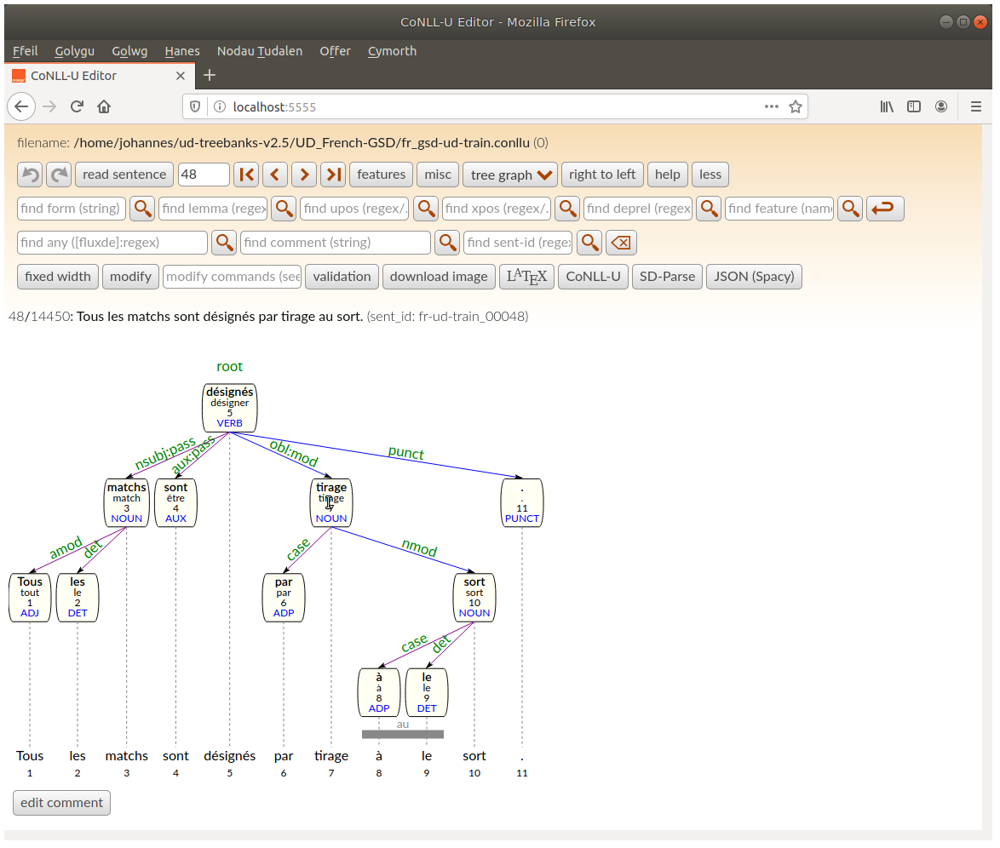

The select button `tree graph` allows to toggle between a dependency tree layout to a more horizontal representation or a tabular view.


The button `fixed width`
displays the tree/hedge width a (configurable) fixed word width.


The table view is still *experimental*, all green fields can be edited:

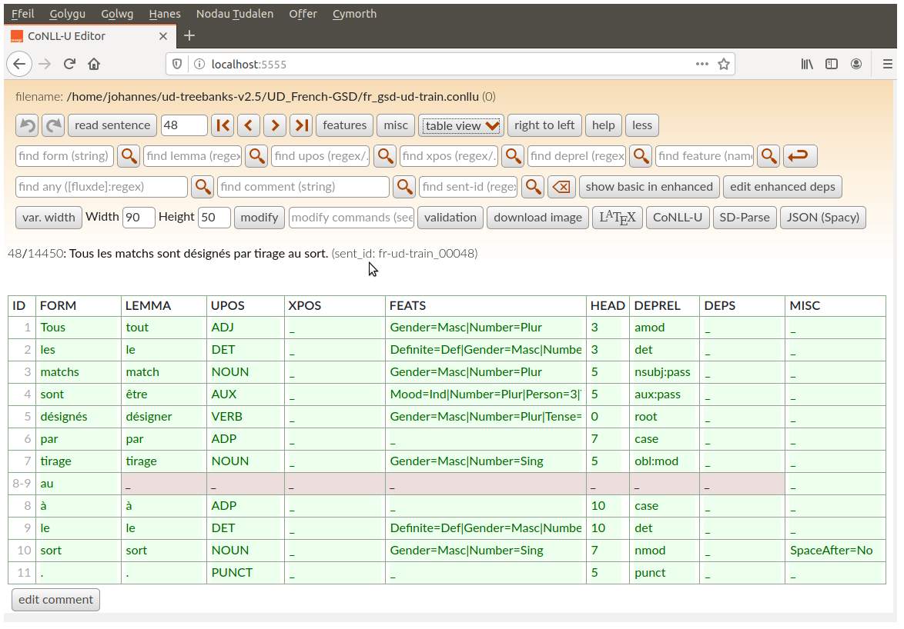


## Editing words and dependency relations

Word editing window (CTRL-click on the word). If UPOS/XPOS/deprels are given to the server,
autocompleting is proposed

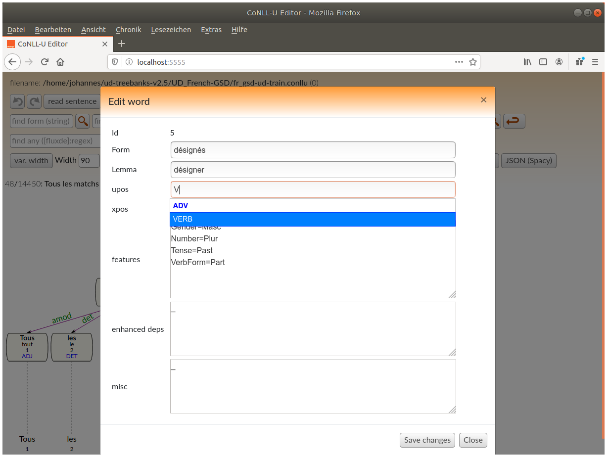

(Basic) Dependency relation window (click on deprel)


For languages which are written from the right to the left like Arabic or Hebrew, activate the `display right to left`-check button

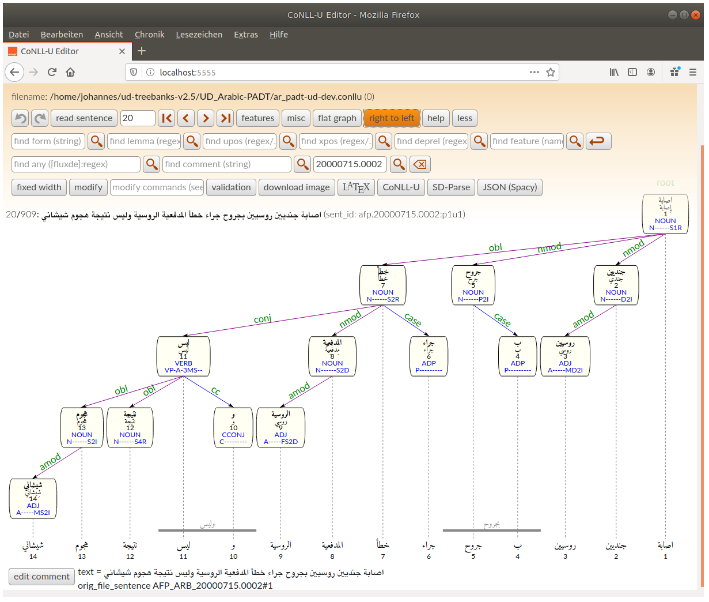

## Empty Nodes

Empty nodes (having `n.1` ids) are shown in a dashed box:

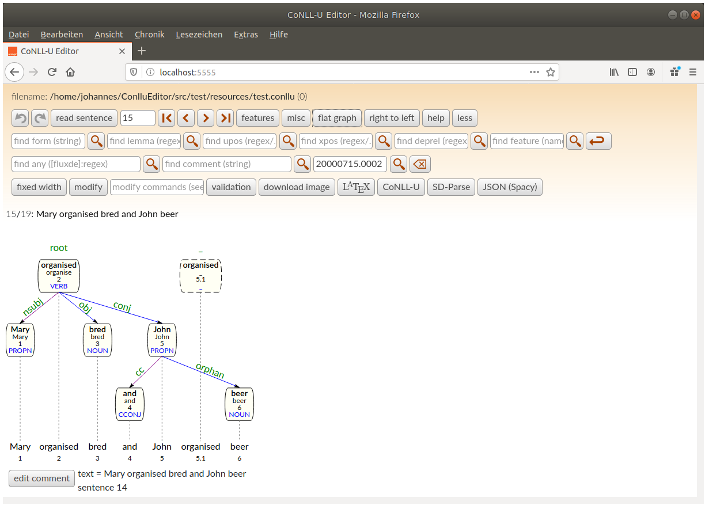

The flat graph mode also displays enhanced dependencies. In this mode enhanced
dependencies can be added/modified/deleted (activate `edit enhanced dependencies`).
if the button `show basic in enhanced` is active, all enhanced dependency relations which are also a basic dependency, are displayed too.

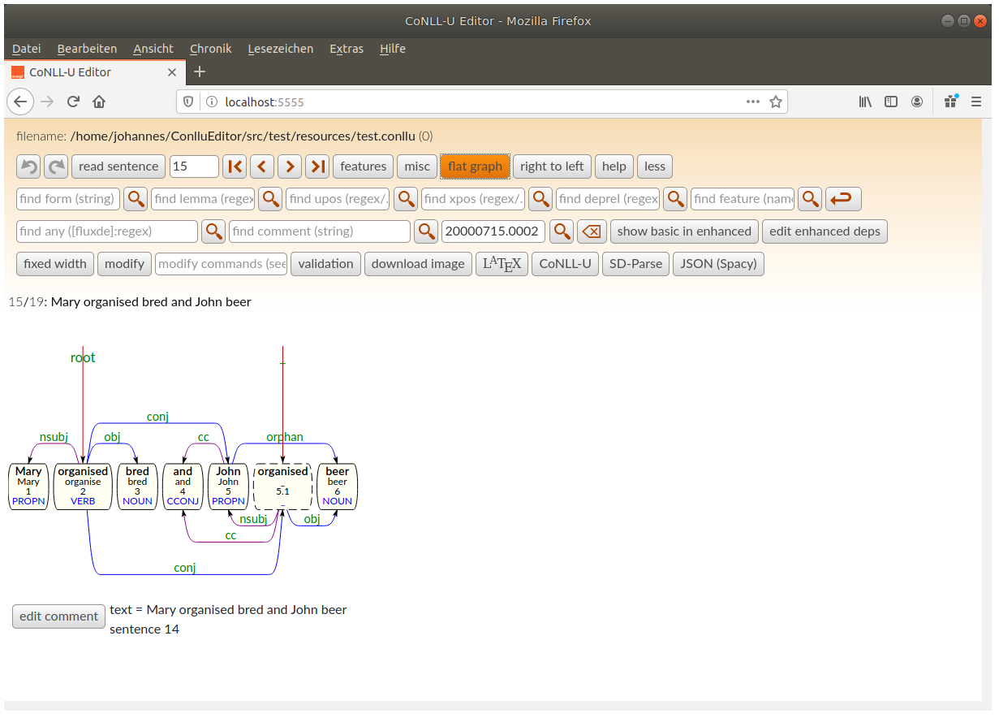

See section [Enhanced Dependencies](#enhanced-dependencies) for more information


## Split or merge adjacent words (editing tokenisation)

In order to split a word or join two (adjacent) words, use the `modify` button: the command `split <wordid>` inserts a new
word to the right of `<wordid>`. This new word can then be edit, with a CTRL-click.
The command `join <wordid>` merges the word with `<wordid>`
with the following. This joined word gets the dependency relation of the word closer to root.

Whole sentences can be split with the `sentsplit <wordid>` command. The current sentences can be concatenated with the following sentence
with `sentjoin` command.

In order to create a multiword token, use the `compose <wordid> <length>`
command. Click on the multiword token bar (at the bottom of the dependency
tree/graph to open a dialogue which allows to edit or delete the token (i.e. the `n-m` line).

## Commands to be used with `modify` button:

* `split id [splitpos]` 	split a word in two (it will be copied to a new node and attached to the same head). If `splitpos` is given, the characters of Form and Lemma left of splitpos will remain in the original word, the rest will be the new word
* `join id` 	merge word with id with the following. If the merged word overlap in any way with a multiword token (MWT), the existing MWT will be deleted
* `insert id form [lemma [upos [xpos]]]` 	add a new word after word with id
* `delete id` 	delete word with id. Any overlapping MWT will also be deleted
* `sentsplit id` 	split current sentence at word id (id will be in the second sentence). Dependency and Enhanced Dependency relations between the words before and after the split will be deleted.
* `sentjoin` 	merge current sentence with following
* `compose id length` 	create a multiword token (MWT). The inserted `n-m` line will contain the form of the word with `id`. In order to edit or delete a multiword token, click on the multiword bar at the bottom of the dependency tree or graph. Setting an end value of 0 deletes the multiword token.
* `tomwt id form1 form2 [form3 ...]` 	Transform an existing word into a MWT. The new MWT keeps the form of the word transformed. All other columns are copied to the first member word, except the form which is `form1` from the command line. `form2` etc are used to initialize the form (and lemma) column of the other members of the MWT. All members are initially attached to the first member using the fixed depedency relation.
* `emptyinsert id form [lemma [upos [xpos]]]` 	add a new empty word after word with `id`. The new empty word gets the id `id.1`, if it is the first empty word at thihs position. If there is already an empty word, the new one will have the id `id.2` etc.
* `emptydelete id.subid` 	delete empty word with id `id.subid`.


## Show CoNLL-U, LaTeX and SD-parse format and file statistics

The buttons `CoNLL-U`, `LaTeX` and `SD-parse` open a window which contains the current sentence in the corresponding format.
LaTeX output includes MWE units as well as enhanced dependencies. The `download` downloads the current image as a svg-file.
A click on the filename on the top of the screens opens a windows with some file
statistics:

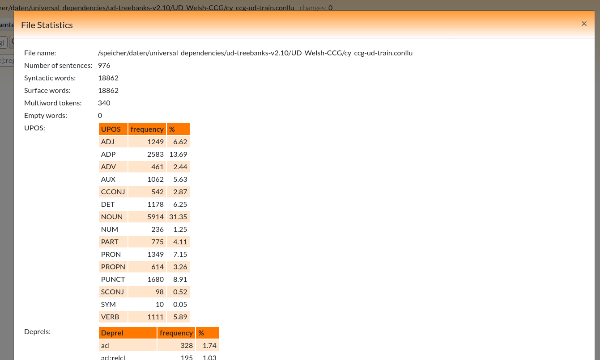

# Searching

The search fields at the top of the screen can be used to search for forms, lemmas, UPOS, XPOS, deprels (or sequences of these),
comments and sentences ids.

* The form and comment search fields accept any string (use double quotes if the search string starts/ends with a blank).   For example
  * `the` finds next occurrance of _the_, including _them_ or _weather_.
  * `" the "` finds next occurrance of the definite article _the_.
  * `some of` finds next occurrance of _some of_ (no quotes necessary, since the search string does not start with a blank).
  * The lemma/upos/xpos search fields accept a /-separated list of regex to find a corresponding sequence, for example
        Upos: `AUX/.*/VERB` looks for a sequence of words with upos tags _AUX_, _any_, _VERB_
* The any search fields accepts a /-separated list of searchfield:regex to find a sequence on different criteria. searchfield can be any of `f`, `l`, `u`, `x`, `d`, `e` (form, lemma, upos, xpos, deprel, enhanced deps) a `%` can be used to search for a word on more than one criterium.
  * `l:the/u:ADJ/l:mouse` looks for a sequence of words, where the first word is _the_, the following any adjective and the last is _mouse_
  * `l:the/u:ADJ%x:JJR/l:mouse` looks for a sequence of words, where the first word is _the_, the following any adjective which has the XPOS JJR and the last word is _mouse_
* The deprel search field accepts a single or a list of regex, separated by `<`, `=` or `>` to search for branches in the dependency tree, for example
  * `cc<nsubj` finds a word with _cc_ deprel whose head has also a _nsubj_ child.
  * `case>mark` finds a word with _case_ deprel which has a child with a _mark_ deprel.
  * `case=det` finds a word with _case_ deprel whose head has a child with a _mark_ deprel.
Click on the loop symbol to start the search. Activate the backwards symbol, to search backwards

Other search modes can be chosen by clicking on the `toggle search modes` buttons:

* complex search and search and replace
* matching subtrees
* no search (to have less headers on top of the GUI)

## Complex search and search and replace

This opens a search and search-and-display field. The search fields provides a simple language to find
sentences with one or several nodes (see [Mass Editing](doc/mass_editing.md))

For instance
```
Upos:NOUN and Deprel:obj and head(Feat:Tense:Pres)
```

N.B. `Feat:Tense=Pres` or `Feat:Tense:Pres` can be used. However, since `=` is a hotkey to start validation on the current sentence `:` is easier to enter.

searches for a sentence which contains a word with Upos `NOUN`, Deprel `obj` and a head which has the feature `Tense=Pres` (click
the `search` button)

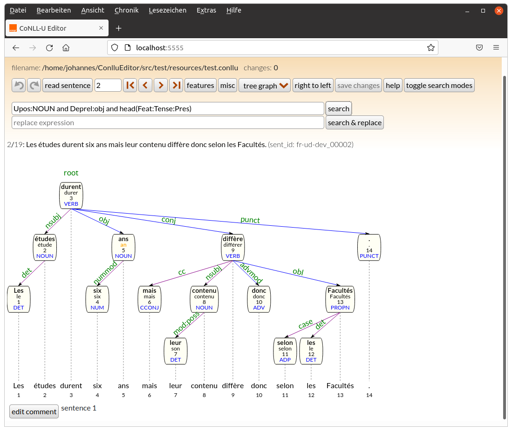

Adding a replace expression (as in [Mass Editing](doc/mass_editing.md)) loke
```
xpos:this(Upos)+"xpos" Feat:"Special:Present"
```

and click `search & replace`. This replaces all matching tokens in the first sentence where at least one token is matching the search condition:

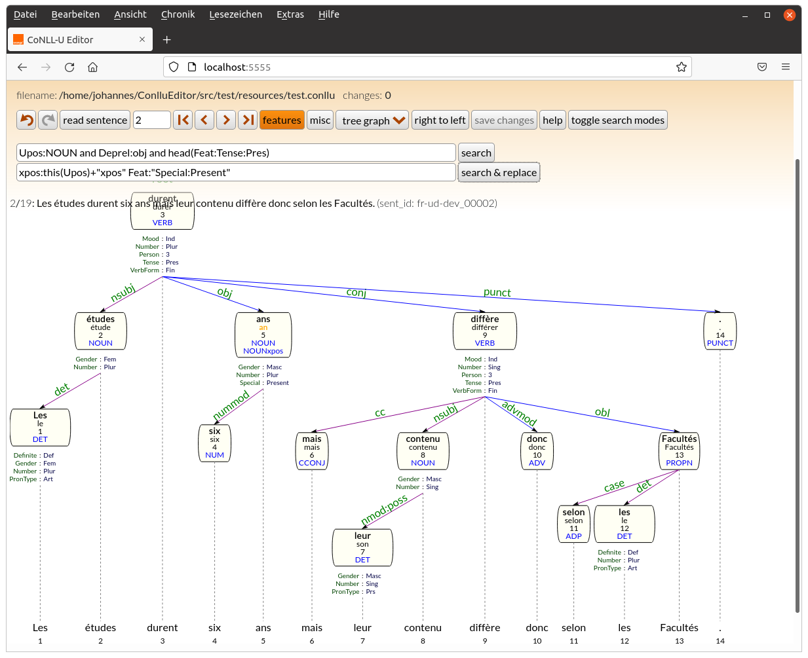

In order to undo this replacement, click the undo button (
), to continue
replacing, click `search & replace` again

## Matching subtrees

This mode allows you to input a tree (using `_` as wildcards and regular expressions).
Clicking the loop symbol searches for a sentence which match the subtree. The subtree must be a valid Conllu(plus) sentence with
a single root. The `_` character matches any value in the sentence. Columns are interpreted as regular expressions.
(N.B. in this mode the `?`-key is no longer a hot-key to display shortcuts)
E.g.

```
# global.columns = ID	LEMMA	UPOS	FEATS	HEAD	DEPREL
1	_	AD.*	_	3	_
2	_	DET	Gender=Fem	3	_
3	_	NOUN	_	0	_
```

matches any sentences wich contains a `NOUN` which as at least two dependants: A `AD.*` (i.e. `ADP` or `ADJ`) and
a `DET` which has the feature `Gender=Fem`. Currently the word order is ignored.

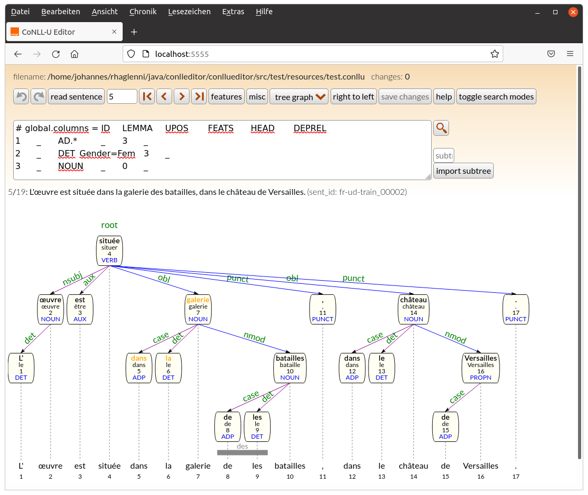

The subtree can be entered using the `sd-parse` format

```
#sdparse
dans un contexte
case(contexte, dans)
det(contexte, un)
```

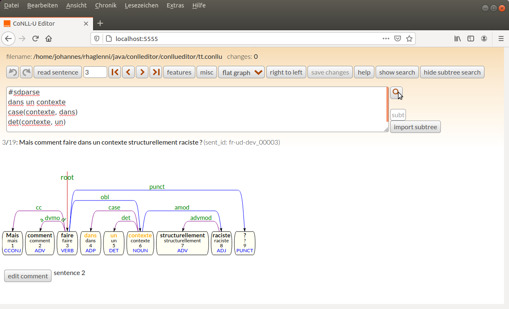

If two words have identical forms, position information must added

```
#sdparse
the cat sees the other cat
nsubj(sees, cat-2)
obj(sees, cat-6)
```


The `sdparse` format may contain `_` as wildcards (in this case position information is obligatory)

```
#sdparse
_ _ _
case(_-3, _-1)
det(_-3, _-2)
```
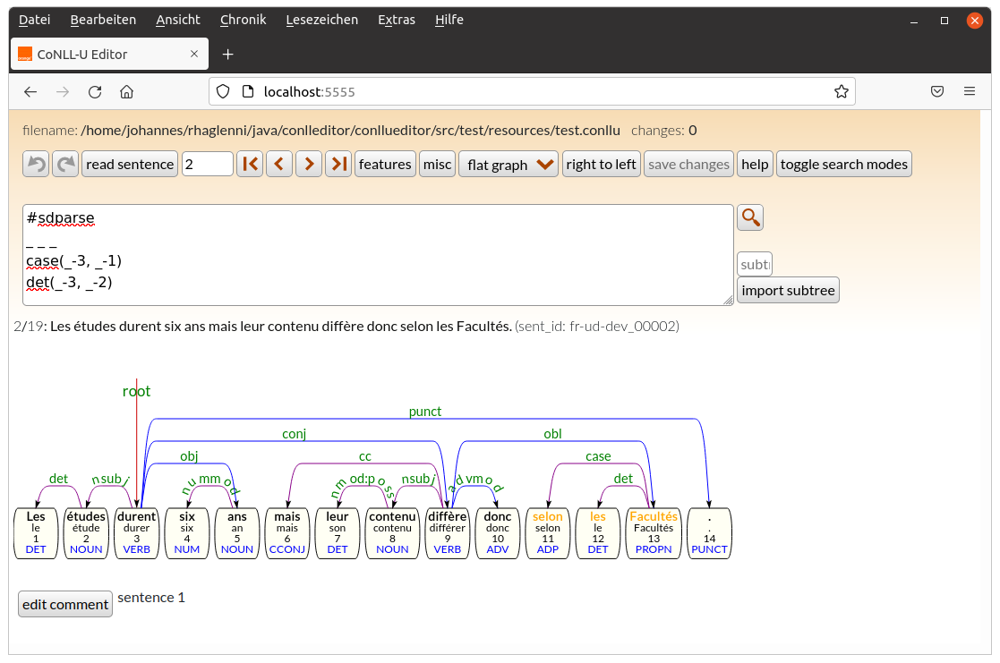

In order facilitate the edition of the subtree, you can enter the Id of a word in the tree and click
the `import subtree`? Doing so enters a partial tree of the word the current sentence and all its direct
and indirect dependents.


If the first line in the subtree window is a valid CoNLL-U Plus column definition,
the imported subtree contains only the indicated columns. For example, if the subtree window
contains (as a first line):

```
# global.columns = ID UPOS HEAD DEPREL
```

`import subtree` imports


# Mass Editing

A simple languages to modify tokens if a (complex condition is met)
see [Mass Editing](doc/mass_editing.md)

## Metadata editing

The CoNLL-U format provides some special comment lines to indicate whether the current sentence is the beginning of a new document, new paragraph, as well as its sentence id, translations (mostly into English) or transliterations.
Clicking on `edit metadata` opens the Metadata dialogue.
For translations, the translations must be prefixed with the language code as shown in the screen shot.
If the words of the current sentence, contains transliteration information (MISC column, Translit field),
the sentence transliteration can be initialized by clicking on `init`


## Enhanced Dependencies
Enhanced dependencies ([http://universaldependencies.org/format.html#syntactic-annotation])
in graphic mode can only be edited in flat mode. If the button `edit enhanced dependencies` is activated
clicking on words creates enhanced dependency relations. Click on the dependency label to modify it or to
delete the enhanced dependency relation.
Alternatively, enhanced dependencies can be edited manually via the word edit menu.


## Other annotation
A subset of the [CoNLL-U Plus](http://universaldependencies.org/ext-format.html) is supported.
The CoNLL-U Plus file must have the standard 10 CoNLL-U columns and the additional columns defined
in the first line

```
# global.columns = ID FORM LEMMA UPOS XPOS FEATS HEAD DEPREL DEPS MISC SEM:NE SEM:COREF
```
Valid CoNLL-U Plus with missing standard columns are currently rejected.

The additional columns are displayed under the graph/hedge and can be edited.
The values in these columns are not interpreted (for instance BIO markings), they are just shown.

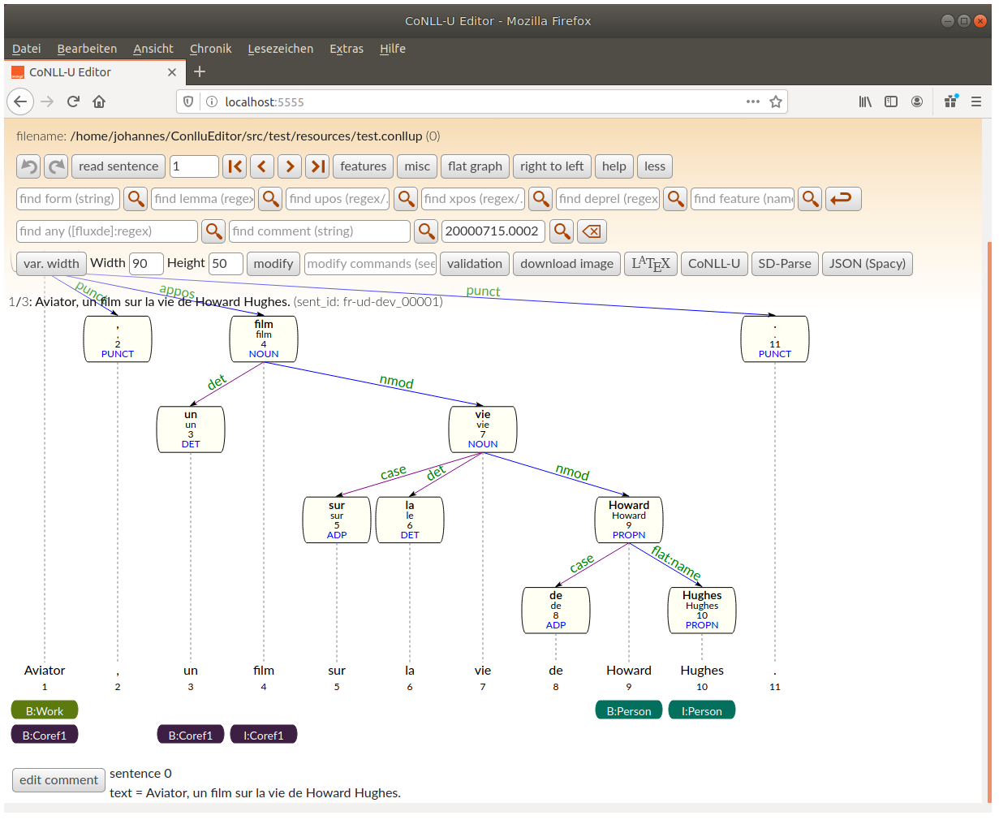


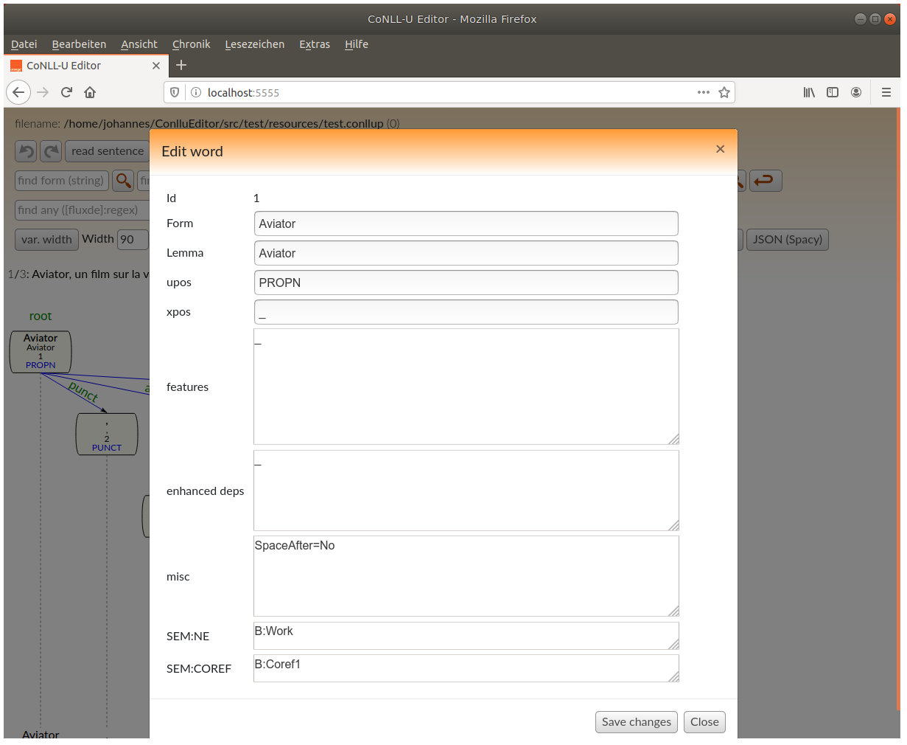

### CoNLL-U / CoNLLu Plus conversion

A simple conversion program is provided to convert any CoNLL-U (Plus) file into another. It takes
as arguments the input file name and a comma separated list of output columns. Specified output columns
absent in the input file will be replaced with `_`. If the output column list is absent, a standard CoNLL-U file is produced.

for instance

`   bin/conlluconvert.sh` [`src/test/resources/test.conllup`](src/test/resources/test.conllup) ` ID,FORM,DEPREL,HEAD,SEM:NE`

generates

```
# global.columns = ID FORM DEPREL HEAD SEM:NE
# sent_id = fr-ud-dev_00001
# sentence 0
# text = Aviator, un film sur la vie de Howard Hughes.
1	Aviator	root	0	B:Work
2	,	punct	1	_
3	un	det	4	_
4	film	appos	1	_
5	sur	case	7	_
6	la	det	7	_
7	vie	nmod	4	_
8	de	case	9	_
9	Howard	nmod	7	B:Person
10	Hughes	flat:name	9	I:Person
...
```

No semantic/plausibility check is performed. E.g.
`bin/conlluconvert.sh <inputfile>  FORM,DEPREL,HEAD`
will happily delete the `ID` column from the output file, so the `HEAD` column does not make much sense anymore.


# Shortcuts

ConlluEdit uses a file [gui/shortcuts.json](gui/hortcuts.json) which defines shortcuts to accelerate editing:
These single letter keys change the UPOS/XPOS/deplabel/feature of
the active word to the defined value. To activate a word, click once on the word.
Shortcuts can be single letters or a sequence of multiple letters:

```
{
    "upos": {
        "AV": "ADV",
        "C": "CCONJ",
        "D": "DET",
        "P": "PROPN",
        "I": "INTJ",
        "A": "ADJ",
        "N": "NOUN",
        "AP": "ADP",
        "R": "PRON",
        "S": "SCONJ",
        "T": "PART",
        "U": "NUM",
        "V": "VERB",
        "X": "AUX",
        ".": "PUNCT"
    },
   "feats": {
       ":ns": "Number=Sing",
       ":np": "Number=Plur",
       ":gf": "Gender=Fem",
       ...
    },
    "deplabel": {
        "a": "amod",
        "av": "advmod",
        "c": "case",
        ....
    }
}
```
There is a timeout, so multi-letter shortcuts must be typed with maximally 700ms intervals. This makes it possible to
define shortcuts with different length and an identical sequence at the beginning
(like above `A` and `AV`).

A personalised list (same format as [gui/shortcuts.json](gui/shortcuts.json)) can be used with the `--shortcuts` option.

There is a list of predefined shortcuts which cannot be altered:

* `+` go to next sentence
* `-` go to preceding sentence
* `=` run validator on current sentence
* `_` delete all features of active word
* `delete`-key deletes active word
* `?` shows/hides list of shortcuts
* `&` followed by _n_ digits: Shift view on the syntax tree so that the token with the given ID is centered in the visible part of the tree.

# Multiuser/save/git

The ConlluEditor can be used by multiple annotators at the time, provided that **no sentence is edited by more than one person at a time**.
To be on the safe side, start a server for every annotator on a different port/machine.
After each modification the edited file is saved:
* if the edited file is in a git versioned directory, each change is git-commited using the sentence number and the word id in the commit message.
* if not, it is saved under a different filename (adding `.2`) in the same directory, the original file is not modified.

# Validation

The ConlluEditor is able to load run a validation script on the current sentence. The programme and its arguments
must be configured in a text file
```
script: /path/to/UniversalDependencies/tools/validate.py --lang cy --max-err 0 --level 5 {FILE}
```
`{FILE}` will be replaced with a file which contains the sentence to be validated in CoNLL-U format.
This configuration file must be given to the server with the option `--validator <filename>`.
The validation button will launch the validator on the current sentence.

# Server API (used by the GUI)
* `curl -F "sentid=1" -F "cmd=read 1"  http://host:port/edit/` get a sentence (first sentence of a file is `read 0`, `sentid` is only used only for editing commands but must be present)
* `curl 'http://host:port/edit/validlists' | jq .` get lists of valid upos/xpos/deprels, filename and version name
* `curl 'http://host:port/edit/getconllu?sentid=10'` get sentence 10 in CoNLL-U format
* `curl 'http://host:port/edit/getlatex?sentid=10'` get sentence 10 in LaTeX format (to use
  with the [tikz-dependency](https://ctan.org/pkg/tikz-dependency) or   [doc/deptree.sty](doc/deptree.sty) packages)

The GUI uses the following API when editing
* `curl -F "sentid=1" -F "cmd=mod upos 3 VERB"  http://host:port/edit/` set upos of word with id 3 to _VERB_ in sentence 1
* `curl -F "sentid=2" -F "cmd=mod pos 4 VERB VV"  http://host:port/edit/` set upos of word with id 4 to _VERB_ and xpos to _VV_ in sentence 2
* `curl -F "sentid=3" -F "cmd=mod extracol 4 SEM:NE B:Person"  http://host:port/edit/` set the non-standard UD column named _SEM:EN_ of word 4 to _B:Person_

`upos` (in the first example) can be replaced with
`form`, `lemma`, `xpos`, `head`, `deprel`, `feat`, `misc` -for the latter two the value must be a comma separated list of `Key=Value`.
In all cases the new version of the edited sentence is returned (in json).
However if the `sentid` or `id` are invalid, an error messages (in json format) is returned.

For searching, the following API is implemented
* `curl -F "sentid=2" -F "cmd=findlemma false regex"  http://host:port/edit/` search forward from sentence 2 onwards for a word whose lemma matches the given regex

To search backwards use `cmd=findlemma true regex`. Other columns can be found with
`findupos`, `findxpos`, `finddeprel`, `findfeat`, `findcomment` (searches comments preceding a sentence)
and `findsentid` (searches `# sent_id`). `findform` can be used for search forms. In difference to the other
`find`-commands, `findform` searches for strings (no regex) in the sentence (across several words)
* `curl -F "sentid=2" -F 'cmd=findword false " in the"'  http://host:port/edit/` searches for the string `in the` (including the preceding space)


# Parser Front-End
In order to display the CoNLL-U output of taggers/dependency parser servers, there the front-end provides a graphical user interface and sends the sentenced to be parsed to the back-end server such as [UDPipe](https://ufal.mff.cuni.cz/udpipe).
You can either use a local instance of the UDPipe-Server, or the instance provided by the authors of UDPipe (http://lindat.mff.cuni.cz/services/udpipe/).

First edit the configuration file [src/test/resources/udpipeserver.conf](src/test/resources/udpipeserver.conf):

```ini
# configuration to  make a request to a UDPipe server

# the url to send raw text to in order to get a CoNLL-U result (HTTP POST)
parse: http://lindat.mff.cuni.cz/services/udpipe/api/process

# headers eventually needed for the server to respond correctly
parseheaders: Accept:application.json, ...

# the URL providing some information on the parser (HTTP GET)
info: http://lindat.mff.cuni.cz/services/udpipe/api/models

# the name of the field to contain the text to be parsed
txt: data

# other fields which need to be present in the call to the parser
other: model=english-ewt-ud-2.5-191206,tokenizer=,tagger=,parser=

# if the parser response is in json, give the path to the CoNLL-U result
jsonpath: result
```

Second, run the Front-End server:

```
./bin/parserclient.sh src/test/resources/udpipeserver.conf 3434
```

Open your browser on the given port: `http://localhost:3434`


The dependency tree can also be displays as a hedge

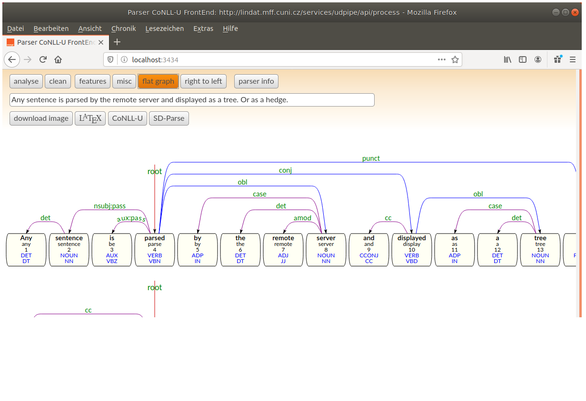

The `parser info` buttons provides information given by the parser server


If the tokenizer segments the input in several sentences, all we be displayed.

The buttons `CoNLL-U`, `LaTeX` and `SD-parse` open a window which contains the current sentence in the corresponding format.
LaTeX output includes MWE units as well as enhanced dependencies. The `download` downloads the current image as a svg-file.


# File Comparison

ConlluEditor permits you to visualise the differences of two CoNLL-U files, as for instance a gold file and
the output of a parsing tool. In order use the comparison mode start ConlluEditor with
an option to indicate the gold file

```
./bin/conlluedit.sh --rootdir  /path/to/ConlluEditor/gui --compare gold.conllu predicted.conllu 8888
```

The dependency tree of the gold file is shown in grey underneath the tree of the file being edited.
The results of some evaluation metrics for the current sentence are presented at the bottom of the header.
Individual words of the edited file, which differ from the gold file are shown with a red border. If the mouse
hovers over such a word, the corresponding lines from the edited file and the gold file are shown
underneath the evaluation scores.
The comparison mode works in the flat view too.


# Transliteration

The MISC columns provides a key `Translit=` for a transliteration of the word form into tha roman alphabet (including diacritics). The python script [bin/transliterate.py](bin/transliterate.py) will read any CoNLL-U file and add a `Tranlist=<value>` field to the MISC column if not already present. The transliteration rules are specified in [bin/translit.json](bin/translit.json).

usage:

```
transliterate.py [-h] [--outfile OUTFILE] --infile INFILE --language LANGUAGE [--raw] [--overwrite] [--sentence]
```

arguments:

 * `-h`, `--help`            show this help message and exit
 * `--outfile OUTFILE`, `-o OUTFILE`  output file
 * `--infile INFILE`, `-i INFILE`           input file
 * `--language LANGUAGE`, `-l LANGUAGE`       language/script
 * `--lemmas`              transliterate lemmas too (into MISC:LTranslit)
 * `--noforms`             do not transliterate forms
 * `--raw`                 raw text, transliterate everything
 * `--overwrite`           overwrite existing transliteration in MISC:Translit and in # translit
 * `--sentence`            add sentence transliteration by concatening forms


For the time being the following scripts/languages are covered
* gk: Gurmukhi script
* si: Singhalese script
* ml: Malayalam script
* kn: Kannada script
* te: Telugu script
* ta: Tamil script
* am: Amharic script
* iu: Inuktitut
* yi: Hebrew/Yiddish (Missing vowel signs are note transliterated)
* hy: Armenian script
* ka: Georgian script (Mkhedruli)
* hi: Devanagari (Hindi)
* gu: Gujarati script
* bn: Bengali script (and to a certain extend Assamese and other languages using the Bengali Alphabet)
* or: Odia script
* th: Thai (ISO 11940 based)
* my: Burmese script
* ja: Japanese (Only Katakana and Hiragana)
* ar: Arabic (Modern Standard Arabic, unvocalized forms are transliterated without vowels)
* arc: Aramaic (unvocalized forms are transliterated without vowels)
* ru: Russian (also processes cyrillic letters for Serbian, and Caucasian languages (like Chechen, Ingush, Avar)
* bg: Bulgarian

Other alphabets with a straight forward transliteration can be added easily added (please send me you updated translit.json file!).
In some cases the transliteration can be erroneous, since this script does not take into account complex context depending transliterations. It is thought as a help for an initial version to be manually validated

# Find similar Sentences

When editing large treebanks it is likely that verys similar or even identical sentences are in the train/validation or test corpora
There is a tool which helps to identify these sentences.

The following command shows all sentences which appear more than once in any of the given files
```
./bin/findsimilar.sh options --group1 file1.conllu file2.conllu ...
```
To find overlapping sentences which are in a test-corpus and in dev- or train-corpus, use

```
./bin/findsimilar.sh options --group1 cy_ccg-ud-dev.conllu cy_ccg-ud-train.conllu --group2 cy_ccg-ud-test.conllu
```

options:
* `--group1 <files>`   first group of conllu files. If `--group2` is absent, all identical/similar sentences in all given files are shown
* `--group2 <files>`   second group of conllu files. If present only sentences overlapping in any file of group1 and in any file of
                       group2 are shown
* `--form <int>`       maximal Levenshtein-Damerau distance for forms (character level, default value 0, deactivate with -1)
* `--deprel <int>`     maximal Levenshtein-Damerau distance for deprel (token level, default: do not check)
* `--feats <int>`      maximal Levenshtein-Damerau distance for feats (token level, default: do not check)
* `--lemma <int>`      maximal Levenshtein-Damerau distance for lemmas (token level, default: do not check)
* `--upos <int>`       maximal Levenshtein-Damerau distance for upos (token level, default: do not check)
* `--xpos <int>`       maximal Levenshtein-Damerau distance for xpos (token level, default: do not check)
* `--threads <int>`    number of threads to use
* `--json` json output


For Form the Levenshtein distance is calculated on characters, whereas for all other columns, the Levenshtein distance
is calculate on a token basis.

Since every sentence will be compared once with every other sentence, 
this will take some time for CoNLL-U files wich many sentences and only a single thread and maximal distances != 0

# Known bugs
* not all possible errors which users can make are checked 😃: e.g. adding weird or non-numerical ids in the CoNLL-U files may crash the server.
The `feature`, and `misc` column fields must contain one or more `|`-separated `name=value` pairs per line (or `_`),
the enhanced dependency field must contain one or more `|`-separated `head:deprel` pairs per line (or `_`).

# Todo list
* be able to read/write any CoNLL-U plus (`.conllp`) files [http://universaldependencies.org/ext-format.html]
* subtree search: allow subtrees which require the absence of a dependant in the matching sentence
* better support for empty nodes
* rewrite ConllWord/ConllSentence classes from scratch
* use list (made from UD annotation guidelines) to warn about invalid relations (e.g. _case_ or _aux_ relations with further dependants)

# Reference

* Johannes Heinecke (2019): [ConlluEditor: a fully graphical editor for Universal dependencies treebank files](https://syntaxfest.github.io/syntaxfest19/proceedings/papers/paper_55.pdf). In: [Universal Dependencies Workshop 2019](http://universaldependencies.org/udw19/). Paris. ([Short demo video](https://syntaxfest.github.io/syntaxfest19/slides/conllueditor_demo_windows_subtitled.mp4))

```
@inproceedings{heinecke2019,
  author = {Heinecke, Johannes},
  title = {{ConlluEditor: a fully graphical editor for Universal Dependencies treebank files}},
  year = {2019},
  booktitle = {{Universal Dependencies Workshop 2019}},
  address = {Paris},
  url = {https://github.com/Orange-OpenSource/conllueditor/},
  howpublished = {\url{https://syntaxfest.github.io/syntaxfest19/proceedings/papers/paper_55.pdf}},
}
```

